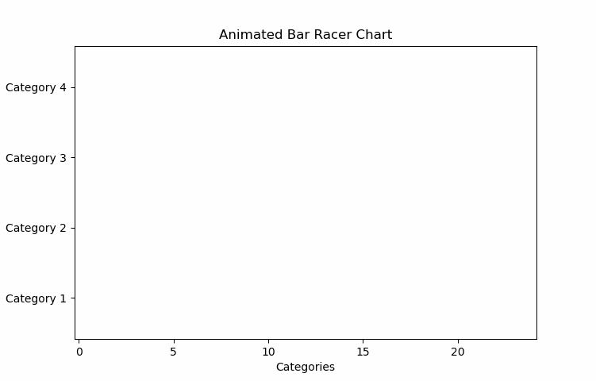

# Animated Bar Chart Racer

## Description

This animated bar chart racer visualizes how data change over time. It displays bar charts for each point in time and maintains them in sorted order, so as the value of one bar surpasses another, the bars switch and they appear to be “racing” (see the example below). 

Our implementation also provides an interface for the user to upload a formatted csv file, choose values for parameters such as axis labels or frame count, and view and export the final animation.

This program was coded in Python, using tkinter for the interface, pandas for data processing, and matplotlib for graphing and animation.

## Examples

### Animation gifs

You can find more examples of saved animations in the [examples](/examples) folder.

### Demonstration video

This video was created for CodeLabs Demo Day and provides a brief demonstration of using the program.

## Authors and acknowledgement
This program was created as part of CodeLabs, an internship through CodeDay. Our interns are Anusha Puri, Lina Chihoub, and Kirsten Graham. Our mentor is Charlie Liu.